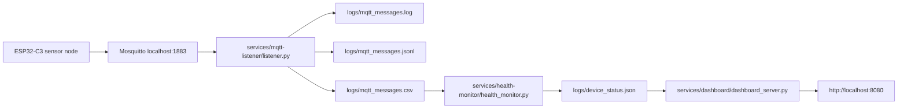

# Raspberry Pi Learning

This repository documents my Raspberry Pi learning journey.

Goals:

- Learn Linux
- Learn Git
- Build an IoT server
- Build a cyberdeck

## ESP32-C3 IoT Sensor Node

This repository includes a PlatformIO project for an ESP32-C3 reusable IoT sensor-node foundation. It connects to Wi-Fi, connects to an MQTT broker on a Raspberry Pi, publishes retained availability, listens for commands, publishes command responses, publishes a compact JSON status payload every 10 seconds, publishes DHT11 temperature/humidity telemetry every 15 seconds, and supports local-network Arduino OTA firmware updates.

The default PlatformIO target is `esp32-c3-devkitm-1`. If your ESP32-C3 board is a different model, update the `board` value in `platformio.ini`.

Copy the secrets template before uploading:

```powershell
Copy-Item include\secrets.example.h include\secrets.h
```

Edit `include/secrets.h` with your local private values:

- `WIFI_SSID`
- `WIFI_PASSWORD`
- `MQTT_BROKER_IP`
- `MQTT_PORT`
- `OTA_PASSWORD`

`include/secrets.h` is ignored by Git. Do not put real credentials in `include/secrets.example.h`.

Configure these hardware values near the top of `src/main.cpp`:

- `DHT_PIN`
- `DHT_TYPE`

### Device Identity

- Device ID: `esp32-c3-test`
- Firmware version: `0.2.0`
- MQTT client ID: generated from the device ID and the ESP32 chip identifier, for example `esp32-c3-test-XXXXXXXXXXXX`
- OTA hostname: `esp32-c3-test`

### MQTT Topic Structure

```text
home/devices/esp32-c3-test/status
home/devices/esp32-c3-test/availability
home/devices/esp32-c3-test/telemetry
home/devices/esp32-c3-test/commands
home/devices/esp32-c3-test/responses
```

OTA support is local-network only. This project does not implement Raspberry Pi hosted firmware, MQTT-triggered downloads, HTTP/HTTPS firmware hosting, automatic deployment, fleet management, or automatic update checking yet.

### DHT11 Sensor Wiring

The default DHT11 module data input is `DHT_PIN = 3`.

Wire the DHT11 Temperature Humidity Sensor Module like this:

```text
DHT11 module VCC   -> ESP32-C3 3V3
DHT11 module GND   -> ESP32-C3 GND
DHT11 module DATA  -> ESP32-C3 GPIO3
```

Most DHT11 modules already include a pull-up resistor on the DATA line. If you are using a bare DHT11 sensor instead of a module, add a 10 kOhm pull-up resistor from DATA to 3V3.

### Availability

The firmware configures MQTT Last Will and Testament so the broker publishes retained `offline` to:

```text
home/devices/esp32-c3-test/availability
```

After a successful MQTT connection, the firmware publishes retained `online` to the same topic.

### Status Payload

Status messages are published every 10 seconds to `home/devices/esp32-c3-test/status` and use this compact JSON shape:

```json
{"device":"esp32-c3-test","firmware_version":"0.2.0","uptime_ms":123456,"wifi_rssi":-57,"free_heap":180000}
```

### Telemetry Payload

DHT11 telemetry is published every 15 seconds to `home/devices/esp32-c3-test/telemetry`.

Successful sensor reads use this compact JSON shape:

```json
{"device":"esp32-c3-test","temperature_c":23.4,"humidity_percent":56.7,"sensor_ok":true,"uptime_ms":123456}
```

If the sensor read fails, the firmware logs a clear Serial error and publishes:

```json
{"device":"esp32-c3-test","temperature_c":null,"humidity_percent":null,"sensor_ok":false,"uptime_ms":123456}
```

The failure payload keeps JSON valid and avoids fake numeric temperature or humidity values.

### Commands

The firmware subscribes to:

```text
home/devices/esp32-c3-test/commands
```

Command responses are published to:

```text
home/devices/esp32-c3-test/responses
```

Incoming command payloads are parsed as JSON, printed to the Serial monitor, executed if supported, and answered with a compact JSON response. Malformed JSON, missing fields, invalid interval values, and unknown commands are rejected gracefully with `success:false`.

Supported commands:

```json
{"command":"read_now"}
```

`read_now` immediately reads the DHT11 and publishes one telemetry payload to `home/devices/esp32-c3-test/telemetry`. This manual read does not reset or delay the normal telemetry schedule.

Successful response:

```json
{"device":"esp32-c3-test","command":"read_now","success":true}
```

```json
{"command":"set_interval","interval_seconds":30}
```

`set_interval` changes the telemetry publish interval while the device is running. `interval_seconds` must be between `5` and `3600` seconds. The setting is temporary and is not saved yet, so it returns to the default after reset or power loss.

Successful response:

```json
{"device":"esp32-c3-test","command":"set_interval","success":true,"interval_seconds":30}
```

Failed response example:

```json
{"device":"esp32-c3-test","command":"set_interval","success":false,"error":"interval_out_of_range"}
```

Other possible command errors include `malformed_json`, `payload_too_large`, `missing_command`, `unknown_command`, `missing_interval_seconds`, and `invalid_interval_seconds`.

### Local-Network OTA

OTA means "over the air": after one successful USB upload, PlatformIO can send later firmware builds to the ESP32 over the local network. The firmware uses the standard Arduino ESP32 OTA service and keeps it available during normal Wi-Fi, MQTT, status, telemetry, and command handling.

OTA starts only after Wi-Fi connects. The Serial monitor prints `[OTA] Ready` with the hostname and IP address when the node can receive OTA uploads. During an update, Serial logs `[OTA]` start, progress, completion, and errors. It does not continuously print OTA messages while idle.

OTA password authentication is enabled with `OTA_PASSWORD` from `include/secrets.h`. PlatformIO OTA uploads use the `ESP32_OTA_PASSWORD` environment variable so the password is not stored in `platformio.ini`.

OTA also requires a partition layout with enough OTA application space. This project explicitly uses `board_build.partitions = default.csv`, which provides OTA app slots for this ESP32-C3 build. If future firmware grows too large, switch to a partition layout with larger OTA app slots before relying on OTA.

If `python -m platformio` reports `No module named platformio` and the path includes `.venv\Scripts\python.exe`, your terminal is using the Raspberry Pi listener virtual environment. That venv does not install PlatformIO by default. In PowerShell, run `deactivate` first, use `pio run ...` if the PlatformIO CLI is on your PATH, or install PlatformIO into the active venv with `python -m pip install platformio`.

Initial USB firmware upload:

```powershell
python -m platformio run -e esp32-c3-devkitm-1 --target upload
python -m platformio device monitor
```

Find the ESP32 IP address using one of these methods:

- Serial monitor: look for `[WiFi] IP address:` or `[OTA] IP address:`
- Router DHCP lease table
- Optional mDNS check: `ping esp32-c3-test.local`

Dependable IP-address-based OTA upload from PowerShell:

```powershell
$env:ESP32_OTA_PASSWORD = "<same value as OTA_PASSWORD in include/secrets.h>"
python -m platformio run -e esp32-c3-devkitm-1-ota --target upload --upload-port 10.0.0.x
```

The same OTA upload from Bash:

```bash
export ESP32_OTA_PASSWORD='<same value as OTA_PASSWORD in include/secrets.h>'
python -m platformio run -e esp32-c3-devkitm-1-ota --target upload --upload-port 10.0.0.x
```

If mDNS works on your network, you can try the hostname instead of the IP address:

```powershell
python -m platformio run -e esp32-c3-devkitm-1-ota --target upload --upload-port esp32-c3-test.local
```

USB recovery if OTA fails:

```powershell
python -m platformio run -e esp32-c3-devkitm-1 --target upload
```

Troubleshooting notes:

- OTA is unavailable until the node has booted OTA-capable firmware from USB at least once.
- Use the IP address if `esp32-c3-test.local` does not resolve.
- Make sure your computer and ESP32 are on the same local network.
- Check firewall rules if the upload cannot connect.
- If you see an OTA auth error, confirm `ESP32_OTA_PASSWORD` exactly matches `OTA_PASSWORD`.
- If an OTA upload is interrupted, use USB recovery and try again.
- If `[WiFi] IP address` and `[OTA] Ready` do not appear, open the Serial monitor first, press reset on the board, and watch the `[WiFi] Waiting for connection` status. `WL_NO_SSID_AVAIL` usually means the SSID cannot be found, `WL_CONNECT_FAILED` often points to credentials, and repeated `WL_DISCONNECTED` means the board still has not joined the network.

### Connection Behavior

Wi-Fi and MQTT reconnection are automatic and use non-blocking `millis()` timing. The firmware avoids long delay calls, prints clear Serial logs for connection attempts, retained availability, command messages, status publishing, and DHT11 telemetry publishing.

Expected publish intervals:

```text
status:    every 10 seconds
telemetry: every 15 seconds by default; temporary runtime changes can update this
```

Useful PlatformIO commands:

```powershell
python -m platformio run
python -m platformio run --target upload
python -m platformio device monitor
```

## Raspberry Pi IoT Platform

The Raspberry Pi side is now organized around service-owned application folders. The current source-of-truth scripts are:

```text
services/mqtt-listener/listener.py
services/health-monitor/health_monitor.py
services/health-monitor/device_status.py
services/dashboard/dashboard_server.py
```

Legacy root-level scripts are now compatibility wrappers. They are retained temporarily so old manual commands and imports still work, but they delegate to the service-owned files above. New service work should target the `services/` layout.

```text
mqtt_listener/listener.py -> services/mqtt-listener/listener.py
health_monitor.py         -> services/health-monitor/health_monitor.py
device_status.py          -> services/health-monitor/device_status.py
dashboard_server.py       -> services/dashboard/dashboard_server.py
```

The repository also stores reference systemd units:

```text
systemd/mqtt-listener.service
systemd/health-monitor.service
systemd/health-monitor.timer
systemd/iot-dashboard.service
```

The live services intentionally keep:

```ini
WorkingDirectory=/home/zack/projects/raspberry-pi
```

That keeps runtime files under the existing repository-root `logs/` directory during this migration phase. Runtime data has not moved to `data/` yet.

### Python Setup

Run these commands on the Raspberry Pi from the repository root:

```bash
python3 -m venv .venv
source .venv/bin/activate
python -m pip install --upgrade pip
python -m pip install -r requirements.txt
```

Make sure Mosquitto is running locally:

```bash
systemctl status mosquitto --no-pager
```

### MQTT Listener

The listener connects to the local MQTT broker at `localhost:1883`, subscribes to `home/#`, prints every received message, and appends the same line to:

```text
logs/mqtt_messages.log
```

When a payload is valid JSON, the listener also writes:

```text
logs/mqtt_messages.jsonl
logs/mqtt_messages.csv
```

The CSV header is created automatically when the file does not exist:

```csv
received_at,topic,device,type,count,uptime_ms,wifi_rssi
```

Missing JSON fields are written as blank CSV values. Raw non-JSON messages, such as retained availability payloads, are still written to the plain text log without crashing the listener.

Manual run from the repository root:

```bash
/home/zack/projects/raspberry-pi/.venv/bin/python \
  services/mqtt-listener/listener.py
```

Live service:

```bash
systemctl status mqtt-listener.service --no-pager
```

### Health Monitor

The health monitor reads:

```text
logs/mqtt_messages.csv
```

It writes the latest device status snapshot to:

```text
logs/device_status.json
```

The monitor keeps the latest message per `device` and marks a device `ONLINE` when its latest message was received within 30 seconds. Otherwise, the device is `OFFLINE`.

Manual run from the repository root:

```bash
/home/zack/projects/raspberry-pi/.venv/bin/python \
  services/health-monitor/health_monitor.py
```

Live timer/service:

```bash
systemctl status health-monitor.timer --no-pager
systemctl status health-monitor.service --no-pager
```

The optional device status helper can also print a terminal table:

```bash
/home/zack/projects/raspberry-pi/.venv/bin/python \
  services/health-monitor/device_status.py
```

### Web Dashboard

The dashboard serves a simple local webpage on port `8080` using only the Python standard library. It reads:

```text
logs/device_status.json
```

Manual run from the repository root:

```bash
/home/zack/projects/raspberry-pi/.venv/bin/python \
  services/dashboard/dashboard_server.py
```

Live service:

```bash
systemctl status iot-dashboard.service --no-pager
```

Open the dashboard on the Raspberry Pi at:

```text
http://localhost:8080
```

From another computer on the same network, replace `localhost` with the Raspberry Pi IP address. The page auto-refreshes every 10 seconds and shows `ONLINE` and `OFFLINE` labels for each device.

If `logs/device_status.json` is missing, the dashboard still loads and shows a friendly empty-state message.

### Current Data Flow



### Service Verification

After deployment or reboot, check:

```bash
systemctl status mqtt-listener.service --no-pager
systemctl status health-monitor.timer --no-pager
systemctl status health-monitor.service --no-pager
systemctl status iot-dashboard.service --no-pager
journalctl -u mqtt-listener.service -n 50 --no-pager
journalctl -u health-monitor.service -n 50 --no-pager
journalctl -u iot-dashboard.service -n 50 --no-pager
```

Confirm each live `ExecStart` points into `services/`:

```bash
systemctl show mqtt-listener.service \
  -p ExecStart -p WorkingDirectory --no-pager
systemctl show health-monitor.service \
  -p ExecStart -p WorkingDirectory --no-pager
systemctl show iot-dashboard.service \
  -p ExecStart -p WorkingDirectory --no-pager
```
