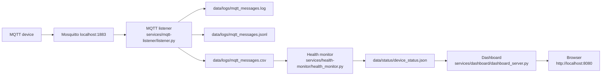

# New Chat Handoff

This document is the starting point for a new Codex chat taking over the Raspberry Pi IoT platform work.

## Start Here

Read these files first:

1. `README.md`
2. `docs/service-layout.md`
3. `docs/platform-config.md`
4. `docs/device-onboarding.md`
5. `TODO.md`

Use `docs/current-state-architecture.md` as the historical pre-migration baseline. The current post-migration source layout is described by `docs/service-layout.md`.

## Current Repository Context

Development repository path in the current workstation chat:

```text
C:\Users\zjose\Documents\RaspberryPi\raspberry-pi-learning
```

Live Raspberry Pi project path:

```text
/home/zack/projects/raspberry-pi
```

The user makes commits manually. Do not commit, push, reset, or perform privileged deployment commands unless explicitly asked.

## Current Platform Shape

Current service-owned scripts:

```text
services/mqtt-listener/listener.py
services/health-monitor/health_monitor.py
services/health-monitor/device_status.py
services/dashboard/dashboard_server.py
```

Shared platform constants:

```text
config/platform.py
```

Runtime data paths:

```text
data/logs/mqtt_messages.log
data/logs/mqtt_messages.jsonl
data/logs/mqtt_messages.csv
data/status/device_status.json
```

Reference systemd units:

```text
systemd/mqtt-listener.service
systemd/health-monitor.service
systemd/health-monitor.timer
systemd/iot-dashboard.service
```

Expected live service working directory:

```ini
WorkingDirectory=/home/zack/projects/raspberry-pi
```

## Current Data Flow



## Device Onboarding Summary

New devices should follow:

```text
home/devices/<device-id>/<message-type>
```

Current message types:

```text
status
availability
telemetry
commands
responses
```

For a device to appear in the current health monitor and dashboard, it must publish valid JSON with a `device` field. The current health/dashboard CSV fields are:

```text
received_at
topic
device
type
count
uptime_ms
wifi_rssi
```

Plain-text retained availability messages are logged, but they do not currently drive dashboard `ONLINE` or `OFFLINE` state.

## Known Important Caveats

- The platform currently has no SQLite database, device registry, MQTT authentication, schema validation, or per-device dashboard views.
- The health monitor groups by JSON `device`, not by parsing the MQTT topic path.
- Any valid JSON message with a `device` field can become the latest health row for that device.
- ESP32 firmware version references are currently aligned to `0.2.1`; when changing firmware versions, update `src/main.cpp`, README examples, and firmware source-contract tests together.
- The default `python -m unittest discover` command does not find tests from the repository root in the current layout; use `python -m unittest discover -s tests -v`.

## Useful Verification Commands

Run the focused Pi platform test suite from the repository root:

```powershell
.\.venv\Scripts\python.exe -m unittest tests.test_platform_config tests.test_legacy_entrypoints tests.test_mqtt_listener tests.test_device_status tests.test_health_monitor tests.test_dashboard_server -v
```

Run broader Python test discovery:

```powershell
.\.venv\Scripts\python.exe -m unittest discover -s tests -v
```

Check whitespace in tracked files:

```powershell
git diff --check
```

On the Raspberry Pi, check live services:

```bash
systemctl status mqtt-listener.service --no-pager
systemctl status health-monitor.timer --no-pager
systemctl status health-monitor.service --no-pager
systemctl status iot-dashboard.service --no-pager
```

## Generic Integration Prompt

Use this prompt in separate project chats when you want to prepare another project for integration into this IoT platform.

```text
I want to integrate this project into my Raspberry Pi IoT platform.

Important constraints:
- Treat the repository currently open in this chat as the source project to inspect.
- Do not modify, move, rename, refactor, delete, stage, commit, or push anything yet.
- Use the Raspberry Pi IoT platform repository and its documentation as a reference only.
- Do not change the Raspberry Pi IoT platform repository from this chat.
- Do not install packages or change system services unless I explicitly approve that later.
- First produce an integration inventory and plan only.

Reference platform context:
- Live Raspberry Pi platform path: /home/zack/projects/raspberry-pi
- Main platform docs to follow:
  - README.md
  - docs/service-layout.md
  - docs/platform-config.md
  - docs/device-onboarding.md
  - TODO.md
- Current MQTT broker target: localhost:1883 on the Raspberry Pi.
- Current listener subscription: home/#
- Preferred device topic contract:
  home/devices/<device-id>/<message-type>
- Supported message types:
  status, availability, telemetry, commands, responses
- Valid JSON payloads should include a stable device field.
- Current health/dashboard fields are:
  device, type, count, uptime_ms, wifi_rssi
- Extra telemetry fields are allowed and preserved in JSONL, but the current dashboard does not display them yet.
- Plain-text retained availability messages are logged, but they do not currently drive dashboard ONLINE/OFFLINE state.

Your task:
1. Inspect the current source project read-only.
2. Identify what the project does and how it runs today.
3. Identify all existing MQTT usage, topics, payloads, device IDs, network assumptions, secrets/configuration, dependencies, scripts, services, and hardware assumptions.
4. Compare the project against the IoT platform onboarding contract.
5. Propose the smallest safe changes needed to integrate it with the platform.
6. Identify what should happen in the source project versus what, if anything, should happen later in the platform repo.
7. Provide a manual verification plan using mosquitto_pub/mosquitto_sub, service logs, platform logs, health monitor output, and dashboard checks.
8. Clearly list risks, unknowns, and questions.

Do not implement the integration until I approve the plan.
```

If the target project chat cannot access the Raspberry Pi platform repository or docs, ask the user to provide the relevant files before inventing platform details.

## Recommended Next Work

Use `TODO.md` as the next-stage backlog. The most useful next step is usually to choose the first outside project to inventory, then decide whether that integration should stay plan-only or become the first real exercise of the onboarding contract.
