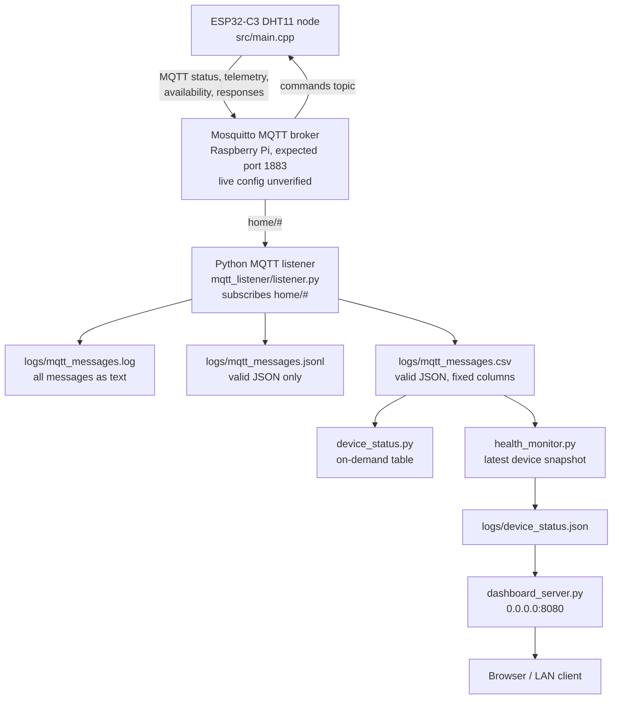
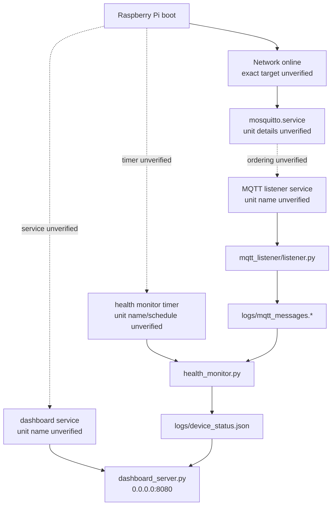

# Current-State Architecture Inventory

Inspection date: 2026-07-25  
Repository root inspected: `C:\Users\zjose\Documents\RaspberryPi\raspberry-pi-learning`  
Inspection mode: documentation and read-only inspection only. No implementation, service, configuration, package, or runtime behavior changes were intentionally made for this inventory.

This document describes the system that exists in the repository and the local workspace at inspection time. Live Raspberry Pi systemd and Mosquitto state could not be verified from this Windows workspace; those sections are marked unresolved and include read-only commands to run directly on the Raspberry Pi.

## 1. Executive Summary

The project is a prototype home IoT platform with three main layers:

| Layer | Current implementation |
| --- | --- |
| Device firmware | PlatformIO Arduino firmware for an ESP32-C3 sensor node with Wi-Fi, MQTT, retained availability, Last Will, DHT11 telemetry, MQTT commands/responses, and local-network OTA. |
| Pi MQTT/logging pipeline | Python MQTT listener subscribes to `home/#` on `localhost:1883`, logs every message to text, logs valid JSON to JSON Lines, and writes selected JSON fields to CSV. |
| Pi health/dashboard pipeline | `health_monitor.py` reads the CSV and writes `logs/device_status.json`; `dashboard_server.py` serves that JSON as a simple web dashboard on port `8080`. |

Important baseline findings:

- The Pi listener is generic at the MQTT subscription level (`home/#`) but not generic in its structured CSV schema.
- The health monitor treats the newest CSV row for a device as the device state, regardless of MQTT topic.
- Availability messages are currently plain text (`online`/`offline`) from the ESP32 firmware, so the Pi listener logs them only to the plain text log, not to JSONL or CSV.
- Newer ESP32 topics such as `responses` are accepted by the listener if JSON, but the CSV schema does not capture command-specific fields like `command`, `success`, or `error`.
- DHT11 telemetry fields (`temperature_c`, `humidity_percent`, `sensor_ok`) are not included in the current Pi CSV health schema.
- No systemd unit files are stored in the repository. Live Pi service/timer details are unverified from this workspace.
- `src/main.cpp` currently reports firmware version `0.2.1`; some repository documentation/tests still appear to reference `0.2.0`. This is an observed current-state inconsistency, not changed here.

## 2. System Purpose

The current system is a learning-project prototype for a Raspberry Pi based home IoT platform. Its observed purpose is to:

- Receive MQTT messages from home devices.
- Store MQTT messages in simple runtime files.
- Produce a lightweight device health snapshot.
- Serve a basic local web dashboard.
- Support one ESP32-C3 DHT11 sensor node that publishes status, telemetry, availability, and command responses.
- Allow local-network OTA firmware uploads to the ESP32-C3 after an initial USB flash.

The project does not currently implement a database, hosted firmware repository, MQTT-triggered firmware downloads, automatic fleet updates, or a full generic device registry.

## 3. Repository Layout

Relevant repository tree, excluding full generated/build/virtual environment contents:

```text
.
|-- .git/                         # Git metadata, not expanded
|-- .gitignore
|-- .pio/                         # PlatformIO build/dependency artifacts, ignored, not expanded
|-- .venv/                        # Local Python virtual environment, ignored, not expanded
|-- .vscode/                      # Editor files, ignored, not expanded
|-- __pycache__/                  # Python bytecode cache, ignored
|-- README.md
|-- dashboard_server.py
|-- device_status.py
|-- health_monitor.py
|-- include/
|   |-- secrets.example.h         # Placeholder firmware private config template, untracked at inspection
|   `-- secrets.h                 # Local private firmware config, ignored
|-- logs/
|   |-- .gitkeep                  # Tracked placeholder
|   `-- device_status.json        # Runtime health snapshot, ignored
|-- mqtt_listener/
|   |-- __init__.py
|   `-- listener.py
|-- platformio.ini
|-- requirements.txt
|-- src/
|   `-- main.cpp                  # ESP32-C3 firmware
`-- tests/
    |-- test_dashboard_server.py
    |-- test_device_status.py
    |-- test_esp32_heartbeat_payload.py
    |-- test_health_monitor.py
    `-- test_mqtt_listener.py
```

Observed file categories:

| Category | Files/directories |
| --- | --- |
| Python applications | `mqtt_listener/listener.py`, `device_status.py`, `health_monitor.py`, `dashboard_server.py` |
| Python package marker | `mqtt_listener/__init__.py` |
| Tests | `tests/*.py` |
| Firmware source | `src/main.cpp` |
| Firmware config/template | `include/secrets.example.h`, `include/secrets.h` |
| PlatformIO config | `platformio.ini` |
| Python dependency file | `requirements.txt` |
| Documentation | `README.md`, `docs/current-state-architecture.md` |
| Logs/runtime data | `logs/*.log`, `logs/*.jsonl`, `logs/*.csv`, `logs/device_status.json`; only `logs/.gitkeep` is tracked |
| Generated/build directories | `.pio/`, `__pycache__/`, `mqtt_listener/__pycache__/`, `tests/__pycache__/` |
| Virtual environment | `.venv/` |
| Git-related | `.git/`, `.gitignore` |
| systemd files | None found in the repository |
| Shell scripts | None found in the repository |
| Mosquitto config files | None found in the repository |

## 4. Running Components

### Python Components

| Component | Path | Purpose | Run mode | Inputs | Outputs | Network |
| --- | --- | --- | --- | --- | --- | --- |
| MQTT listener | `mqtt_listener/listener.py` | Connects to local MQTT broker and records all `home/#` messages. | Continuous process. | MQTT messages from `localhost:1883`, topic filter `home/#`. | stdout, `logs/mqtt_messages.log`, `logs/mqtt_messages.jsonl`, `logs/mqtt_messages.csv`. | MQTT client to `localhost:1883`. |
| Device status utility | `device_status.py` | Prints simple latest-device health report from CSV. | On demand CLI. | `logs/mqtt_messages.csv`. | stdout table. | None. |
| Health monitor | `health_monitor.py` | Builds latest per-device status JSON snapshot. | On demand or timer-driven. | `logs/mqtt_messages.csv`. | stdout JSON and `logs/device_status.json`. | None. |
| Dashboard server | `dashboard_server.py` | Serves simple auto-refreshing web dashboard. | Continuous process. | `logs/device_status.json` read per request. | HTTP HTML responses. | Binds `0.0.0.0:8080`. |
| MQTT listener package marker | `mqtt_listener/__init__.py` | Marks listener package; contains only a docstring. | Not directly run. | None. | None. | None. |

### Firmware Component

| Component | Path | Purpose | Run mode | Inputs | Outputs | Network |
| --- | --- | --- | --- | --- | --- | --- |
| ESP32-C3 sensor node firmware | `src/main.cpp` | DHT11 sensor node with Wi-Fi, MQTT status/telemetry/availability/commands/responses, and OTA. | Continuous on ESP32-C3. | DHT11 sensor on GPIO3, MQTT command topic, Wi-Fi config from `include/secrets.h`. | MQTT status, telemetry, availability, responses; Serial logs; OTA service. | MQTT to configured broker IP/port; Arduino OTA over LAN. |

### Component Details

| Script | Important constants | Files read | Files written | Third-party packages |
| --- | --- | --- | --- | --- |
| `mqtt_listener/listener.py` | `BROKER_HOST = "localhost"`, `BROKER_PORT = 1883`, `TOPIC_FILTER = "home/#"`, `LOG_PATH`, `JSONL_PATH`, `CSV_PATH`, fixed `CSV_COLUMNS`. | None, aside from imports/config constants. | `logs/mqtt_messages.log`, `logs/mqtt_messages.jsonl`, `logs/mqtt_messages.csv`. | `paho-mqtt`. |
| `device_status.py` | `CSV_PATH = logs/mqtt_messages.csv`, `ONLINE_THRESHOLD = 30 seconds`, fixed CSV/report columns. | `logs/mqtt_messages.csv`. | None. | Standard library only. |
| `health_monitor.py` | `STATUS_JSON_PATH = logs/device_status.json`. | `logs/mqtt_messages.csv`. | `logs/device_status.json`. | Standard library only; imports helpers from `device_status.py`. |
| `dashboard_server.py` | `STATUS_JSON_PATH = logs/device_status.json`, `HOST = "0.0.0.0"`, `PORT = 8080`. | `logs/device_status.json`. | None. | Standard library only. |

## 5. Current Architecture Diagram



## 6. MQTT Architecture

### Broker Assumptions

| Source | Broker host/address | Port | Notes |
| --- | --- | --- | --- |
| `mqtt_listener/listener.py` | `localhost` | `1883` | Listener assumes it runs on the same Raspberry Pi as Mosquitto. |
| `include/secrets.example.h` | `10.0.0.180` | `1883` | ESP32 example config points to the Raspberry Pi IP that was current during development. |
| `include/secrets.h` | [REDACTED local string] | `1883` observed | Private ignored file contains actual local firmware config. |

### Subscriptions

| Component | Subscribed topic/filter | Behavior |
| --- | --- | --- |
| Python listener | `home/#` | Receives all MQTT messages under `home/`; no topic-specific routing. |
| ESP32-C3 firmware | `home/devices/esp32-c3-test/commands` | Parses command payloads as JSON and publishes command responses. |

### Publications

| Component | Published topics |
| --- | --- |
| Python listener | None. |
| Device status utility | None. |
| Health monitor | None. |
| Dashboard server | None. |
| ESP32-C3 firmware | `home/devices/esp32-c3-test/status`, `home/devices/esp32-c3-test/telemetry`, `home/devices/esp32-c3-test/availability`, `home/devices/esp32-c3-test/responses`. |

### ESP32 Topic Layout

The ESP32 firmware currently uses these hard-coded topic constants:

```text
home/devices/esp32-c3-test/status
home/devices/esp32-c3-test/availability
home/devices/esp32-c3-test/telemetry
home/devices/esp32-c3-test/commands
home/devices/esp32-c3-test/responses
```

The topic strings embed `esp32-c3-test`; they are not dynamically composed from `DEVICE_ID` in the current source.

### Payload Formats Observed

Status payload from ESP32:

```json
{"device":"esp32-c3-test","firmware_version":"0.2.1","uptime_ms":123456,"wifi_rssi":-57,"free_heap":180000}
```

DHT11 telemetry success payload:

```json
{"device":"esp32-c3-test","temperature_c":23.4,"humidity_percent":56.7,"sensor_ok":true,"uptime_ms":123456}
```

DHT11 telemetry failure payload:

```json
{"device":"esp32-c3-test","temperature_c":null,"humidity_percent":null,"sensor_ok":false,"uptime_ms":123456}
```

Availability payloads:

```text
online
offline
```

Availability behavior:

- MQTT Last Will is configured to publish retained `offline`.
- After MQTT connection, firmware publishes retained `online`.
- The Pi listener does not apply special availability handling. Because these payloads are not JSON, they are appended only to `logs/mqtt_messages.log`.

Supported command payloads:

```json
{"command":"read_now"}
```

```json
{"command":"set_interval","interval_seconds":30}
```

Command responses:

```json
{"device":"esp32-c3-test","command":"set_interval","success":true,"interval_seconds":30}
```

```json
{"device":"esp32-c3-test","command":"set_interval","success":false,"error":"interval_out_of_range"}
```

### Pi Payload Handling

`mqtt_listener/listener.py` behavior:

- Decodes every payload as UTF-8 with replacement for invalid bytes.
- Attempts `json.loads`.
- If JSON parsing fails:
  - Prints and appends a raw text line to `logs/mqtt_messages.log`.
  - Does not write JSONL.
  - Does not write CSV.
- If JSON parsing succeeds:
  - Prints and appends a text line including `device` and `type` if the parsed payload is a JSON object.
  - Appends JSON Lines record with `received_at`, `topic`, and raw parsed `payload`.
  - Appends CSV row with fixed columns: `received_at`, `topic`, `device`, `type`, `count`, `uptime_ms`, `wifi_rssi`.

### Current Pi Support Gaps for Newer ESP32 Topic Model

Confirmed observations:

- The listener subscribes broadly to `home/#`, so it receives newer topics.
- The listener does not parse device IDs from topic paths.
- The CSV schema does not include DHT11 fields: `temperature_c`, `humidity_percent`, `sensor_ok`.
- The CSV schema does not include command response fields: `command`, `success`, `error`, `interval_seconds`.
- The health monitor groups rows by the `device` field in CSV, not by topic.
- Any valid JSON payload with `device` can become the latest health row for that device, including command responses.
- Plain-text retained availability messages do not reach the health monitor.

Recommendation/inference for future migration:

- A future generic IoT platform probably needs topic-aware routing and schemas per message type, or a richer event table/log that preserves all JSON fields.

## 7. Data Flow

Current observed flow:

1. ESP32-C3 publishes MQTT messages to the Mosquitto broker.
2. The Python listener connects to `localhost:1883` and subscribes to `home/#`.
3. The listener writes all received messages to `logs/mqtt_messages.log`.
4. For valid JSON messages only, the listener writes:
   - Full JSON object to `logs/mqtt_messages.jsonl`.
   - A fixed subset of fields to `logs/mqtt_messages.csv`.
5. `device_status.py` can read the CSV and print a one-time health table.
6. `health_monitor.py` can read the CSV and write `logs/device_status.json`.
7. `dashboard_server.py` reads `logs/device_status.json` and serves HTML on port `8080`.

Important limitation:

- The dashboard does not compute health itself.
- The dashboard does not invoke `health_monitor.py`.
- The dashboard shows whatever snapshot currently exists in `logs/device_status.json`.
- If `health_monitor.py` is not run periodically, the dashboard can show stale data.

## 8. Data Storage and Logging

| Path | Format | Writer | Reader(s) | Purpose | Git state | Future treatment |
| --- | --- | --- | --- | --- | --- | --- |
| `logs/.gitkeep` | Placeholder text file | Developer/manual | None | Keeps `logs/` directory present in Git. | Tracked. | Source-control placeholder is fine. |
| `logs/mqtt_messages.log` | Plain text, one line per MQTT message | `mqtt_listener/listener.py` | Human/operator | Full append-only readable MQTT log. | Ignored by `.gitignore`; not present locally at inspection. | Runtime data. |
| `logs/mqtt_messages.jsonl` | JSON Lines | `mqtt_listener/listener.py` | Future tools/human; no current in-repo reader observed | Structured full valid-JSON MQTT payload log. | Ignored by `.gitignore`; not present locally at inspection. | Runtime data. |
| `logs/mqtt_messages.csv` | CSV | `mqtt_listener/listener.py` | `device_status.py`, `health_monitor.py` | Fixed-column structured log for health reporting. | Ignored by `.gitignore`; not present locally at inspection. | Runtime data; schema migration risk. |
| `logs/device_status.json` | JSON object | `health_monitor.py` | `dashboard_server.py` | Latest generated status snapshot for dashboard. | Ignored by `.gitignore`; present locally. | Runtime generated data. |
| `.pio/` | PlatformIO build/dependency artifacts | PlatformIO | PlatformIO | Firmware build cache. | Ignored. | Generated build data. |
| `.venv/` | Python virtual environment | Python venv tooling | Python commands when activated | Local Python dependency environment. | Ignored. | Local environment, not source. |
| `__pycache__/`, `mqtt_listener/__pycache__/`, `tests/__pycache__/` | Python bytecode | Python interpreter | Python interpreter | Import/test cache. | Ignored. | Generated cache. |
| `include/secrets.h` | C++ header | Developer/manual | `src/main.cpp` | Local private firmware config. | Ignored. | Private config; do not commit. |

### Current CSV Schema

`mqtt_listener/listener.py` writes:

```csv
received_at,topic,device,type,count,uptime_ms,wifi_rssi
```

Field meaning:

| Column | Source |
| --- | --- |
| `received_at` | Local listener timestamp, ISO format to seconds. |
| `topic` | MQTT topic string. |
| `device` | `payload["device"]` if valid JSON object, otherwise blank. |
| `type` | `payload["type"]` if valid JSON object, otherwise blank. |
| `count` | `payload["count"]` if present. |
| `uptime_ms` | `payload["uptime_ms"]` if present. |
| `wifi_rssi` | `payload["wifi_rssi"]` if present. |

### Current `logs/device_status.json` Schema

Generated by `health_monitor.py`:

```json
{
  "generated_at": "2026-07-05T10:04:23-06:00",
  "source": "logs\\mqtt_messages.csv",
  "devices": [],
  "message": "No CSV log found at logs\\mqtt_messages.csv."
}
```

When devices exist, each device object contains:

```json
{
  "device": "device-name",
  "status": "ONLINE",
  "received_at": "timestamp",
  "topic": "topic",
  "type": "type",
  "count": "count",
  "uptime_ms": "uptime_ms",
  "wifi_rssi": "wifi_rssi"
}
```

`ONLINE` is based on latest message received within 30 seconds.

## 9. Python Environment and Dependencies

### Dependency Files

`requirements.txt` contains:

```text
paho-mqtt>=2.1.0,<3.0.0
```

The dashboard, health monitor, and device status utility use only the Python standard library.

### Local Python Environment Observed

| Environment | Python | Path | Observed packages |
| --- | --- | --- | --- |
| Project `.venv` | Python 3.13.12 | `C:\Users\zjose\Documents\RaspberryPi\raspberry-pi-learning\.venv\Scripts\python.exe` | `paho` not importable; `platformio` not importable. |
| Global/current `python` | Python 3.13.12 | `C:\Users\zjose\scoop\apps\python313\current\python.exe` | `paho` importable; `platformio` importable. |

This local Windows observation may differ from the Raspberry Pi runtime environment.

### systemd Python Invocation

Unverified. No service unit files are present in the repository, so there is no repository-defined `ExecStart` showing whether services use:

- System Python.
- A virtual environment Python.
- `python -m mqtt_listener.listener`.
- Direct script paths.

Read-only command to run on the Raspberry Pi after discovering unit names:

```bash
systemctl show UNIT_NAME \
  -p FragmentPath \
  -p WorkingDirectory \
  -p ExecStart \
  -p Environment \
  -p EnvironmentFiles \
  --no-pager
```

## 10. systemd Services and Timers

No `.service` or `.timer` files were found in the repository.

Live Raspberry Pi systemd state could not be inspected from this Windows workspace because `systemctl` is not available locally and no remote Pi connection was used.

### Known/Expected Roles

These roles are expected from the project background, but exact unit names and states are unresolved:

| Unit | Type | Enabled | Current state | Executable/script | Working directory | Dependencies |
| --- | --- | --- | --- | --- | --- | --- |
| `mosquitto.service` | Service | Unverified | Unverified | Mosquitto broker | External to repo | Usually network/service manager dependent; exact directives unverified. |
| MQTT listener service | Service | Unverified | Unverified | Expected to run `mqtt_listener/listener.py` or module equivalent | Unverified | Should depend on or order after Mosquitto/network, but exact directives unverified. |
| Health monitor service | Service | Unverified | Unverified | Expected to run `health_monitor.py` | Unverified | Likely timer-triggered; exact directives unverified. |
| Health monitor timer | Timer | Unverified | Unverified | Triggers health monitor service | N/A | Timer schedule unverified. |
| Dashboard service | Service | Unverified | Unverified | Expected to run `dashboard_server.py` | Unverified | Should read `logs/device_status.json`; ordering unverified. |

### Read-Only Pi Commands to Resolve systemd State

Run on the Raspberry Pi:

```bash
systemctl list-unit-files --type=service --type=timer \
  | grep -Ei 'mosquitto|mqtt|iot|dashboard|health|device'
```

```bash
systemctl list-units --all --type=service --type=timer \
  | grep -Ei 'mosquitto|mqtt|iot|dashboard|health|device'
```

For each relevant unit:

```bash
systemctl status UNIT_NAME --no-pager
systemctl cat UNIT_NAME
systemctl show UNIT_NAME \
  -p Id \
  -p Description \
  -p FragmentPath \
  -p UnitFileState \
  -p ActiveState \
  -p SubState \
  -p User \
  -p Group \
  -p WorkingDirectory \
  -p ExecStart \
  -p Environment \
  -p EnvironmentFiles \
  -p Restart \
  -p WantedBy \
  -p After \
  -p Wants \
  -p Requires \
  --no-pager
```

For timers:

```bash
systemctl list-timers --all | grep -Ei 'mqtt|iot|dashboard|health|device'
systemctl cat TIMER_NAME
systemctl show TIMER_NAME \
  -p Unit \
  -p OnBootUSec \
  -p OnUnitActiveUSec \
  -p OnCalendar \
  -p Persistent \
  -p ActiveState \
  -p UnitFileState \
  --no-pager
```

### Paths That Would Break If Files Move

Confirmed from code:

- Python scripts use relative paths such as `logs/mqtt_messages.csv` and `logs/device_status.json`.
- Those paths resolve relative to the process working directory.
- If systemd `WorkingDirectory` points at the repository root, moving files or changing working directory without updating units would break logging/dashboard behavior.

Unverified:

- Exact systemd `WorkingDirectory` and `ExecStart` values.
- Exact absolute paths embedded in unit files.

## 11. Boot and Startup Sequence

Live boot sequence is unverified from this workspace.

Based on repository code, a working boot sequence would need the following:

1. Raspberry Pi starts Mosquitto.
2. MQTT listener starts and connects to `localhost:1883`.
3. MQTT listener subscribes to `home/#`.
4. Health monitor runs periodically or on demand to create/update `logs/device_status.json`.
5. Dashboard server starts and binds `0.0.0.0:8080`.
6. ESP32 connects to Wi-Fi, connects to MQTT broker at configured Pi IP, publishes retained availability, status, and telemetry.
7. Dashboard reads the current `logs/device_status.json` snapshot on each HTTP request.

What is confirmed:

- The code can generate missing log folders automatically when scripts run from the repository root.
- `dashboard_server.py` handles missing `logs/device_status.json` by showing an empty-state message.
- `health_monitor.py` handles missing CSV by writing a JSON report with empty `devices` and a message.
- `mqtt_listener/listener.py` creates `logs/` before writing.

What is unverified:

- Which units start automatically after boot.
- Whether units explicitly order after `mosquitto.service`.
- Whether the health monitor is timer-driven on the Pi.
- Whether the dashboard is actually run by systemd.
- Whether unit `WorkingDirectory` values are set to the repository root.

### Boot/Service Relationship Diagram



## 12. Mosquitto Configuration

No Mosquitto configuration files are present in the repository.

Live Mosquitto configuration could not be verified from this Windows workspace.

Confirmed project assumptions:

- Python listener connects to `localhost:1883`.
- README references `systemctl status mosquitto`.
- ESP32 example firmware config points to Raspberry Pi broker IP `10.0.0.180` port `1883`.
- Python listener does not configure MQTT username/password.
- ESP32 firmware does not currently include MQTT username/password fields in `include/secrets.example.h`.

Unverified live Pi details:

- Listener configuration in Mosquitto.
- Whether Mosquitto binds only localhost or all interfaces.
- Whether anonymous access is enabled.
- Whether password files are configured.
- Whether persistence is enabled.
- Mosquitto service active/enabled state.

Read-only commands to run on the Raspberry Pi:

```bash
systemctl status mosquitto --no-pager
systemctl cat mosquitto
```

```bash
sudo grep -RIn \
  -E '^(listener|port|allow_anonymous|password_file|persistence|persistence_location|include_dir|per_listener_settings)' \
  /etc/mosquitto /etc/default/mosquitto 2>/dev/null
```

```bash
ss -ltnp | grep -E '(:1883|:8080)'
```

If credentials are configured in Mosquitto, do not paste password contents into documentation; record only the file path and authentication mode.

## 13. Networking Assumptions

| Component | Host/address | Port | Binding/client behavior |
| --- | --- | --- | --- |
| Python MQTT listener | `localhost` | `1883` | Assumes broker runs on same Raspberry Pi. |
| ESP32 firmware | `MQTT_BROKER_IP` from `include/secrets.h`; example value `10.0.0.180` | `1883` | Assumes fixed or known Raspberry Pi LAN IP. |
| Dashboard | `0.0.0.0` | `8080` | Binds all interfaces. |
| PlatformIO OTA | Default `esp32-c3-test.local`; documented IP fallback | OTA/espota defaults | mDNS may work, IP fallback is documented. |

Hard-coded or fixed assumptions:

- `mqtt_listener/listener.py`: `BROKER_HOST = "localhost"`.
- `mqtt_listener/listener.py`: `BROKER_PORT = 1883`.
- `dashboard_server.py`: `HOST = "0.0.0.0"`.
- `dashboard_server.py`: `PORT = 8080`.
- `include/secrets.example.h`: `MQTT_BROKER_IP = "10.0.0.180"`.
- `platformio.ini`: OTA `upload_port = esp32-c3-test.local`.

The Raspberry Pi DHCP address changed during development and temporarily broke ESP32 MQTT communication. The ESP32 side still depends on a configured broker address rather than service discovery.

## 14. Secrets and Configuration

### Private Configuration

`include/secrets.h` exists locally and is ignored by Git. Its observed fields are:

```text
WIFI_SSID = [REDACTED STRING]
WIFI_PASSWORD = [REDACTED STRING]
MQTT_BROKER_IP = [REDACTED STRING]
MQTT_PORT = 1883
OTA_PASSWORD = [REDACTED STRING]
```

Actual secrets were not printed into this document.

### Template Configuration

`include/secrets.example.h` contains placeholder values:

```text
WIFI_SSID
WIFI_PASSWORD
MQTT_BROKER_IP = 10.0.0.180
MQTT_PORT = 1883
OTA_PASSWORD
```

At inspection time, `include/secrets.example.h` was present in the working tree but not listed by `git ls-files`.

### Configuration Mixed Into Source

Confirmed hard-coded non-secret configuration:

- ESP32 device ID: `esp32-c3-test`.
- ESP32 firmware version: `0.2.1` in `src/main.cpp`.
- ESP32 MQTT topic constants embed `esp32-c3-test`.
- DHT11 GPIO: `DHT_PIN = 3`.
- MQTT listener host/port/topic: `localhost`, `1883`, `home/#`.
- Listener log file paths under `logs/`.
- Health threshold: 30 seconds.
- Dashboard bind: `0.0.0.0:8080`.
- PlatformIO board/env names.

### Secret Risk

Confirmed:

- `.gitignore` includes `include/secrets.h`.
- `.gitignore` ignores runtime log outputs.
- Current `src/main.cpp` includes `secrets.h` and does not define Wi-Fi credentials directly.

Risk to verify before committing:

- Previous working-tree history or diffs may have included credentials before the secrets header split. Review diffs carefully before committing.
- `include/secrets.example.h` should contain only placeholder values.
- Do not use broad copy/paste of local private config into docs/issues.

Useful read-only checks:

```bash
git status --short --ignored
git diff -- . ':!include/secrets.h'
git ls-files include/secrets.h
```

## 15. Git/Repository State

Observed branch:

```text
main...origin/main
```

Observed tracked files before this document was created:

```text
.gitignore
README.md
dashboard_server.py
device_status.py
health_monitor.py
logs/.gitkeep
mqtt_listener/__init__.py
mqtt_listener/listener.py
platformio.ini
requirements.txt
src/main.cpp
tests/test_dashboard_server.py
tests/test_device_status.py
tests/test_esp32_heartbeat_payload.py
tests/test_health_monitor.py
tests/test_mqtt_listener.py
```

Observed working tree before this document was created:

```text
 M .gitignore
 M README.md
 M platformio.ini
 M src/main.cpp
 M tests/test_esp32_heartbeat_payload.py
?? include/
!! .pio/
!! .venv/
!! .vscode/
!! __pycache__/
!! include/secrets.h
!! logs/device_status.json
!! mqtt_listener/__pycache__/
!! tests/__pycache__/
```

This document adds:

```text
docs/current-state-architecture.md
```

Tracked runtime/generated files:

- `logs/.gitkeep` only.

Ignored runtime/generated files observed:

- `logs/device_status.json`
- `.pio/`
- `.venv/`
- `.vscode/`
- `__pycache__/`
- `mqtt_listener/__pycache__/`
- `tests/__pycache__/`
- `include/secrets.h`

## 16. External Paths and Dependencies

Confirmed local paths:

| Path | Use |
| --- | --- |
| `C:\Users\zjose\Documents\RaspberryPi\raspberry-pi-learning` | Inspected repository root on Windows. |
| `.venv\Scripts\python.exe` | Local ignored venv Python; does not currently have `paho` or `platformio` importable. |
| `C:\Users\zjose\scoop\apps\python313\current\python.exe` | Current Windows Python; has `paho` and `platformio` importable. |

External runtime dependencies:

| Dependency | Used by | Declared where |
| --- | --- | --- |
| Mosquitto | MQTT broker | Not configured in repo; README references service check. |
| `paho-mqtt` | `mqtt_listener/listener.py` | `requirements.txt`. |
| Python 3 | All Python scripts | README setup instructions. |
| PlatformIO | ESP32 firmware build/upload | `platformio.ini`; not a Python runtime dependency for Pi services. |
| PubSubClient | ESP32 MQTT | `platformio.ini`. |
| DHT sensor library | ESP32 DHT11 | `platformio.ini`. |
| Adafruit Unified Sensor | DHT library support | `platformio.ini`. |
| ArduinoJson | ESP32 command JSON | `platformio.ini`. |
| ArduinoOTA, WiFi | ESP32 framework libraries | Arduino ESP32 framework, pulled by PlatformIO. |

Unverified external Pi paths:

- systemd unit file paths under `/etc/systemd/system` or `/lib/systemd/system`.
- Mosquitto config paths under `/etc/mosquitto`.
- Raspberry Pi repository path and venv path.
- Any service `WorkingDirectory` values.

## 17. Fragile Paths and Migration Risks

Confirmed fragile paths/assumptions:

| Risk | Why it matters |
| --- | --- |
| Relative `logs/...` paths | All Python runtime data paths depend on process working directory. Moving scripts or changing systemd `WorkingDirectory` can redirect or break logs. |
| Dashboard reads only `logs/device_status.json` | Dashboard does not recompute health and can show stale or missing data if the monitor/timer is not running. |
| Health monitor reads only CSV | If listener CSV schema changes or CSV is missing, health output is empty. |
| Fixed CSV schema | DHT11 fields and command response fields are not captured. |
| Health grouping by payload `device` only | Messages with device but unrelated topic can become the latest health record. |
| Availability ignored by health | Retained `online`/`offline` is plain text and excluded from JSONL/CSV. |
| ESP32 broker IP configured as static string | Raspberry Pi DHCP changes can break ESP32 MQTT. |
| ESP32 topic strings hard-code device ID | Device ID and topics can diverge if only `DEVICE_ID` changes. |
| systemd units not stored in repo | Migration requires live Pi inspection before moving files. |
| Service ordering unverified | MQTT listener may or may not explicitly wait for Mosquitto/network. |
| No current database | Runtime state is file-based and order/timing sensitive. |
| Local `.venv` incomplete on Windows | Active venv lacks `paho` and `platformio`; commands can fail depending on selected Python. |
| Firmware version inconsistency | `src/main.cpp` shows `0.2.1`; some docs/tests observed `0.2.0`. |

## 18. Technical Debt

### Confirmed Observations

- No repository-owned systemd unit files.
- No repository-owned Mosquitto config.
- Runtime files live inside the source checkout under `logs/`.
- Python apps use relative paths instead of a central configurable data directory.
- CSV schema is inherited from the original heartbeat workflow and is not aligned with current DHT11 telemetry.
- Pi code does not parse the newer `home/devices/<device-id>/<kind>` topic model.
- Health state can be influenced by any valid JSON message with a `device` field.
- ESP32 firmware topic strings and device ID are separately hard-coded.
- ESP32 firmware relies on a fixed broker address in secrets.
- Local Python environment state is split: ignored `.venv` does not have app dependencies, while global Python does.
- Current source, docs, and tests appear to have a firmware version mismatch.

### Recommendations/Inferences for Future Migration

- Move runtime data out of the source tree or make the data directory explicit.
- Store systemd unit templates in the repository after inventorying the live Pi units.
- Introduce a central config strategy for Pi apps.
- Add a topic-aware message model.
- Preserve all MQTT fields in structured storage, even if health uses only some fields.
- Treat availability as first-class device state.
- Use stable networking for the Pi broker: DHCP reservation, hostname, or service discovery with documented fallback.
- Keep secrets outside Git and add a pre-commit checklist for secret review.
- Align tests and documentation with the current firmware version before migration.

## 19. Current Strengths

- Simple, understandable pipeline with few moving parts.
- Python Pi tools mostly use the standard library.
- MQTT listener handles malformed JSON and invalid UTF-8 without crashing.
- Runtime log folders are created automatically by the writer scripts.
- Dashboard has safe fallbacks for missing or malformed status JSON.
- Tests exist for listener, health, dashboard, device status, and firmware source contracts.
- ESP32 firmware uses non-blocking `millis()` scheduling for status, telemetry, Wi-Fi reconnect, MQTT reconnect, commands, and OTA handling.
- ESP32 MQTT availability uses retained `online` and Last Will retained `offline`.
- ESP32 OTA password is sourced from ignored private config rather than hard-coded in `main.cpp`.
- Generated logs and private secrets are ignored by `.gitignore`.

## 20. Questions/Unknowns

Unverified items that must be resolved before migration:

1. What are the actual systemd unit names for the listener, health monitor, timer, and dashboard?
2. Are those units enabled, active, inactive, or failed?
3. What exact `ExecStart` and `WorkingDirectory` values do the units use?
4. Do units explicitly depend on `mosquitto.service` or `network-online.target`?
5. What timer schedule runs `health_monitor.py`, if any?
6. Is Mosquitto configured for anonymous access or authentication?
7. Does Mosquitto bind to all interfaces, localhost only, or a specific listener?
8. Is Mosquitto persistence enabled?
9. What is the actual Raspberry Pi repository path?
10. Which Python interpreter do systemd units use?
11. Does the Pi venv have `paho-mqtt` installed?
12. Are real runtime `mqtt_messages.log`, `.jsonl`, and `.csv` files present on the Pi?
13. Is firmware `0.2.1` the intended current version, or should docs/tests be updated from `0.2.0`?
14. Should DHT11 telemetry fields be reflected in Pi CSV/health/dashboard before reorganization?

## 21. Pre-Migration Checklist

Before moving, renaming, or refactoring anything:

1. On the Raspberry Pi, capture relevant systemd units:

   ```bash
   systemctl list-unit-files --type=service --type=timer \
     | grep -Ei 'mosquitto|mqtt|iot|dashboard|health|device'
   systemctl list-units --all --type=service --type=timer \
     | grep -Ei 'mosquitto|mqtt|iot|dashboard|health|device'
   ```

2. For each IoT unit, save read-only details:

   ```bash
   systemctl cat UNIT_NAME
   systemctl show UNIT_NAME \
     -p FragmentPath \
     -p UnitFileState \
     -p ActiveState \
     -p SubState \
     -p User \
     -p Group \
     -p WorkingDirectory \
     -p ExecStart \
     -p Environment \
     -p EnvironmentFiles \
     -p Restart \
     -p WantedBy \
     -p After \
     -p Wants \
     -p Requires \
     --no-pager
   ```

3. Capture timer schedule:

   ```bash
   systemctl list-timers --all | grep -Ei 'mqtt|iot|dashboard|health|device'
   systemctl cat TIMER_NAME
   ```

4. Capture Mosquitto status and config without exposing passwords:

   ```bash
   systemctl status mosquitto --no-pager
   systemctl cat mosquitto
   sudo grep -RIn \
     -E '^(listener|port|allow_anonymous|password_file|persistence|persistence_location|include_dir|per_listener_settings)' \
     /etc/mosquitto /etc/default/mosquitto 2>/dev/null
   ```

5. Record open ports:

   ```bash
   ss -ltnp | grep -E '(:1883|:8080)'
   ```

6. Record runtime file locations and sizes:

   ```bash
   pwd
   find logs -maxdepth 1 -type f -printf '%p %s bytes\n'
   ```

7. Verify Python environment on the Pi:

   ```bash
   python3 --version
   ./.venv/bin/python --version
   ./.venv/bin/python -c "import paho.mqtt.client as mqtt; print('paho ok')"
   ```

8. Confirm no secrets are staged or tracked:

   ```bash
   git status --short --ignored
   git ls-files include/secrets.h
   git diff --cached
   ```

9. Decide whether runtime logs should be migrated, archived, or discarded.
10. Decide whether systemd units should be brought into the repository as templates.
11. Decide the future data directory before changing `WorkingDirectory`.
12. Decide how the platform should represent device state versus raw MQTT events.
13. Update service paths only after the new layout exists and has been tested.
14. Keep USB recovery available for the ESP32 before changing OTA-related paths/config.
