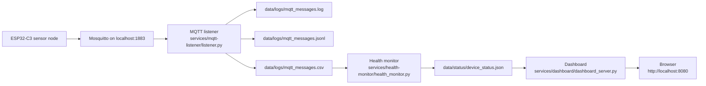

# Current Service Layout

This document records the post-migration Raspberry Pi service layout. It complements `docs/current-state-architecture.md`, which remains the pre-migration architecture baseline.

## Source of Truth

The current service-owned Python entrypoints are:

| Component | Current path | Runtime model |
| --- | --- | --- |
| MQTT listener | `services/mqtt-listener/listener.py` | Continuous systemd service |
| Health monitor | `services/health-monitor/health_monitor.py` | Timer-triggered oneshot service |
| Health/status helper | `services/health-monitor/device_status.py` | Imported by health monitor; optional CLI |
| Dashboard | `services/dashboard/dashboard_server.py` | Continuous systemd service |

Legacy root-level files are retained only as compatibility wrappers during the migration period:

```text
mqtt_listener/listener.py -> services/mqtt-listener/listener.py
health_monitor.py         -> services/health-monitor/health_monitor.py
device_status.py          -> services/health-monitor/device_status.py
dashboard_server.py       -> services/dashboard/dashboard_server.py
```

## Runtime Paths

Runtime data now lives under repository-root `data/`:

```text
data/logs/mqtt_messages.log
data/logs/mqtt_messages.jsonl
data/logs/mqtt_messages.csv
data/status/device_status.json
```

The systemd units keep:

```ini
WorkingDirectory=/home/zack/projects/raspberry-pi
```

The legacy root-level `logs/` directory may still exist as historical runtime data during migration, but current services read and write `data/`.

## Configuration

Shared defaults live in:

```text
config/platform.py
```

This module centralizes:

- MQTT broker host, port, and topic filter
- Runtime data paths
- MQTT CSV columns
- Device report columns
- Online threshold
- Dashboard host and port

The services still expose their previous local constant names as aliases for compatibility, but those values now come from `config/platform.py`.

## systemd Units

Repository-owned reference units:

```text
systemd/mqtt-listener.service
systemd/health-monitor.service
systemd/health-monitor.timer
systemd/iot-dashboard.service
```

Expected live service names:

| Unit | Purpose | Expected script |
| --- | --- | --- |
| `mqtt-listener.service` | Subscribe to `home/#` and write MQTT logs | `services/mqtt-listener/listener.py` |
| `health-monitor.service` | Build latest device status JSON | `services/health-monitor/health_monitor.py` |
| `health-monitor.timer` | Run the health monitor every minute | `health-monitor.service` |
| `iot-dashboard.service` | Serve the local dashboard on port 8080 | `services/dashboard/dashboard_server.py` |

No database, MQTT authentication, or device registry has been added yet.

## Device Onboarding Status

The platform can accept additional MQTT devices now if they publish valid JSON under `home/#` with a `device` field. Those messages are logged, included in JSONL, and can appear in the health monitor and dashboard.

The current dashboard is still a generic health table. Device-specific telemetry fields are preserved in JSONL but are not displayed unless they match the fixed CSV/report columns.

## Data Flow



## Verification

Check the running services:

```bash
systemctl status mqtt-listener.service --no-pager
systemctl status health-monitor.timer --no-pager
systemctl status health-monitor.service --no-pager
systemctl status iot-dashboard.service --no-pager
```

Check the active paths:

```bash
systemctl show mqtt-listener.service \
  -p ExecStart -p WorkingDirectory --no-pager
systemctl show health-monitor.service \
  -p ExecStart -p WorkingDirectory --no-pager
systemctl show iot-dashboard.service \
  -p ExecStart -p WorkingDirectory --no-pager
```

Check recent logs:

```bash
journalctl -u mqtt-listener.service -n 50 --no-pager
journalctl -u health-monitor.service -n 50 --no-pager
journalctl -u iot-dashboard.service -n 50 --no-pager
```

Check runtime files:

```bash
ls -l data/logs/mqtt_messages.log
ls -l data/logs/mqtt_messages.jsonl
ls -l data/logs/mqtt_messages.csv
ls -l data/status/device_status.json
```

## Rollback Notes

Each migration stage has its own rollback note:

```text
docs/mqtt-listener-migration.md
docs/health-monitor-migration.md
docs/dashboard-migration.md
docs/device-status-migration.md
```

Prefer using those stage-specific rollback steps. The broad rollback pattern is to point the affected systemd unit back to the previous root-level script, run `sudo systemctl daemon-reload` if the unit file changed, then restart the affected service.

Do not delete legacy root-level wrappers until the service layout has been stable through normal reboots and timer runs, and any manual habits or external references have been updated to the `services/` paths.
